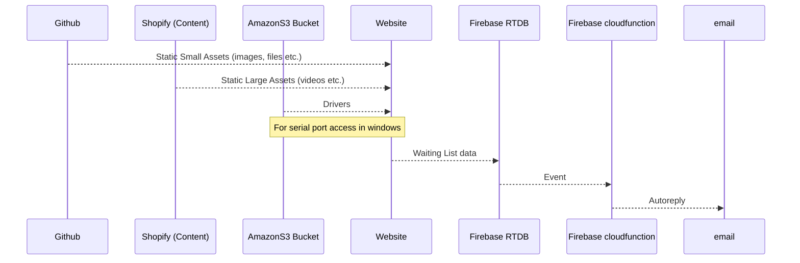

# Datta Baum Studio

The Studio's public facing website with built in store. 

Public Facing: [dattabaumstudio.com](https://www.dattabaumstudio.com/)

For Testing and unlinked: [dattabaumstudio.vercel.app](https://dattabaumstudio.vercel.app/)

---

🌐 Built with [Astro](https://astro.build/) and [TailwindCSS](https://tailwindcss.com/) and hosted in (Linked To) [Vercel](https://vercel.com/dev-datta-baum-studio)

## ⚖️ Editing policy pages 

The policy pages are written in markdown and can be found:

1. [Terms](/src/pages/disclaimer.md)
2. [Privacy](/src/pages/privacy.md)
3. [Returns](/src/pages/returns.md)
4. [Disclaimer](/src/pages/disclaimer.md)

## ✍🏼 Editing other content 

Most of the other content is either inline in code or as JavaScript Objects. When editing any of these care must be taken to ensure that the content is valid HTML/JavaScript.

      Share which parts of the contents are located where, specifically "text contents"? 
      For example: "Here are the policy texts...", "here are the main page texts ...",  etc.
      Can you show where are the assets (where they are pulled from, for example)? 
      For example: "Images here here ...", "video are here ...", "some other things are here ... " etc.
      What specific care should be taken? for example: "Do not leave white space ..." 

## 🔌 What's connected to what ... 🧐 ?? 

## 👨🏻‍💻 Deployment

- The site is automatically deployed on every push to the `main` branch.
- To create preview deployments before making it live, create a new branch, push to it and then create a pull request to `main`.
- This will create a preview deployment that can be shared with others.
- Once satified with the changes, merge the pull request into `main` to make it live.

