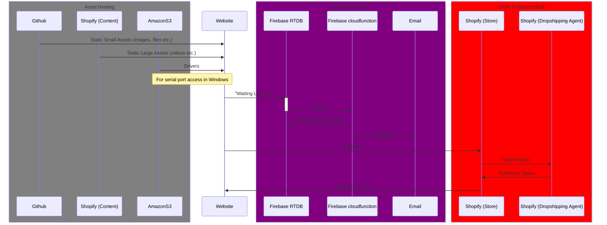

# Datta Baum Studio

The Studio's public facing website with built in store.

Public Facing: [dattabaumstudio.com](https://www.dattabaumstudio.com/)

For Testing and unlinked: [dattabaumstudio.vercel.app](https://dattabaumstudio.vercel.app/)

---

🌐 Built with [Astro](https://astro.build/) and [TailwindCSS](https://tailwindcss.com/) and hosted in (Linked To) [Vercel](https://vercel.com/dev-datta-baum-studio)

## ⚖️ Editing policy pages

The policy pages are written in markdown and can be found:

1. [Terms](/src/pages/disclaimer.md)
2. [Privacy](/src/pages/privacy.md)
3. [Returns](/src/pages/returns.md)
4. [Disclaimer](/src/pages/disclaimer.md)

## ✍🏼 Editing other content

- Most of the other content is either inline in code or as JavaScript Objects.
- When editing any of these care must be taken to ensure that the content is **Valid HTML / JavaScript**.
- This includes there aren't any syntax errors, missing closing tags, etc. It's best to use a code editor with syntax highlighting and linting, instead of editing directly on GitHub.

## 💾 Where is the content stored?

- All images are stored in the [assets/images](/arc/assets/images) folder.
- All videos are stored in [shopify](https://admin.shopify.com/store/f2888f-3/content/files).
- Content for the main pages is as follows:

1. [Home](/src/pages/index.astro)
   - [Marquee](/src/components/HeroMarquee.tsx)
2. [About](/src/pages/about.astro)
3. [Contact](/src/pages/contact.astro)
4. [Watch](/src/pages/watch/index.astro)
   - [Watch Section](/src/components/watch/WatchSection.astro)
   - [Craftsmanship Section](/src/components/watch/CraftsmanshipSection.astro)
   - [Specs Section](/src/components/watch/SpecsSection.astro)
5. [FAQ](/src/pages/watch/faq.astro)
   - [Reset Time Using Serial](/src/components/watch/ResetTimeUsingSerial.astro)
   - [Reset Time Using Button](/src/components/watch/ResetTimeUsingButton.astro)

## 🔌 What's connected to what ... 🧐 ??

## 👨🏻‍💻 Deployment

- The site is automatically deployed in [Vercel](https://vercel.com/dev-datta-baum-studio/dattabaumstudio-com) on every push to the `main` branch.
- To create preview deployments before making it live, create a new branch, push to it and then create a pull request to `main`.
- This will create a preview deployment that can be shared with others.
- Once satified with the changes, merge the pull request into `main` to make it live.

**Note:** Use the same email in github & vercel.
